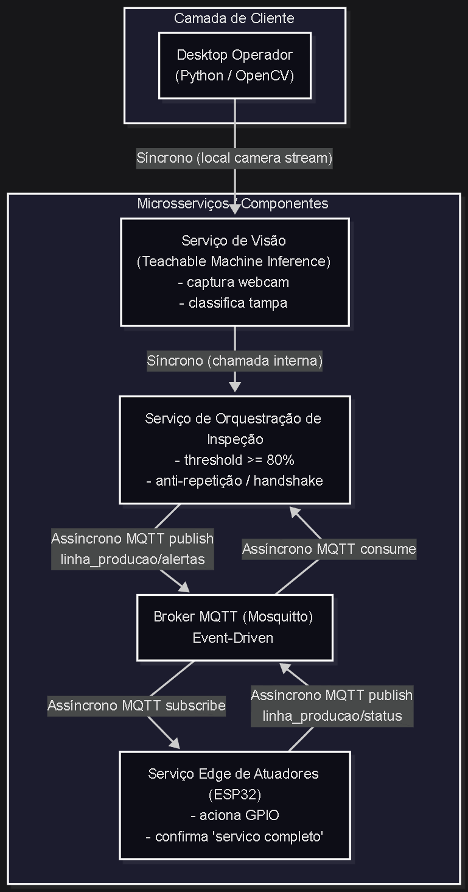

# Analise de Arquitetura - Inspecao de Qualidade com Teachable Machine + MQTT + ESP32

## 1. Objetivo da Solucao

Esta arquitetura implementa uma linha de inspecao visual em tempo real para classificacao de tampas via webcam, com tomada de decisao local e acionamento fisico por ESP32.

Fluxo principal:
1. O desktop captura frames da webcam e executa inferencia com modelo Teachable Machine.
2. Quando a classificacao ultrapassa o limiar de confianca, o evento e publicado no MQTT.
3. O ESP32 consome o evento, aciona a saida digital e publica "servico completo".
4. O desktop libera uma nova publicacao apenas apos esse retorno (handshake anti-repeticao).

## 2. Camadas e Componentes

### 2.1 Camada de Cliente
- Desktop Operador (Python/OpenCV): unico canal implementado no estado atual.
- Web e Mobile: previstos como extensao para supervisao e monitoramento.

### 2.2 Entrada e Seguranca
- O projeto nao possui camada de seguranca por requisito.
- Implicacao arquitetural: operacao recomendada em rede confiavel/isolada.

### 2.3 Componentes de Negocio (Modularizacao)
- Servico de Visao:
	- Captura webcam.
	- Pre-processa imagem.
	- Executa inferencia com Keras/TensorFlow.
- Servico de Orquestracao de Inspecao:
	- Aplica regra de limiar (threshold de confianca).
	- Aplica deduplicacao por classe detectada.
	- Controla handshake de bloqueio/liberacao para evitar acionamentos repetidos.
- Broker MQTT (Mosquitto):
	- Backbone orientado a eventos.
	- Desacopla produtor (visao) e consumidor (ESP32).
- Servico Edge de Atuadores (ESP32):
	- Interpreta payload MQTT.
	- Aciona GPIO por tempo definido.
	- Publica evento de conclusao do servico.

## 3. Comunicacao (Sincrona vs Assincrona)

### 3.1 Sincrona
- Pipeline local de visao (captura de camera + inferencia + regra de decisao).
- Chamada interna entre inferencia e orquestracao no mesmo processo Python.

### 3.2 Assincrona (Event-Driven)
- MQTT publish: `linha_producao/alertas` (Python -> Broker).
- MQTT subscribe: `linha_producao/alertas` (ESP32 <- Broker).
- MQTT publish: `linha_producao/status` (ESP32 -> Broker).
- MQTT consume: `linha_producao/status` (Python <- Broker).

Resultado arquitetural: o sistema reduz acoplamento temporal entre deteccao e atuacao fisica, com sincronizacao de estado via eventos.

## 4. Camada de Dados

### 4.1 Estado Atual (implementado)
- Nao ha banco relacional, NoSQL ou cache dedicado no codigo atual.
- Estado operacional e mantido em memoria no processo Python:
	- `aguardando_servico`
	- `servico_completo_recebido`
	- `last_mqtt_class`
- O broker MQTT transporta mensagens, mas nao substitui persistencia historica de negocio.

### 4.2 Arquitetura Alvo (recomendada para escala)
- Relacional (PostgreSQL/MySQL):
	- Ordens de inspecao, rastreabilidade por lote, auditoria.
- NoSQL (MongoDB):
	- Eventos brutos de classificacao e telemetria de alta frequencia.
- Cache (Redis):
	- Estado instantaneo da linha, ultimo status do equipamento, leitura de baixa latencia.

## 5. Qualidades Arquiteturais

### 5.1 Pontos Fortes
- Baixa latencia: inferencia local sem dependencia de cloud.
- Simplicidade operacional: poucos componentes para PoC/producao local.
- Desacoplamento por mensageria: evolucao facilitada para novos consumidores MQTT.

### 5.2 Riscos e Limitacoes
- Sem seguranca de transporte/autenticacao no MQTT.
- Sem persistencia nativa de historico para analise posterior.
- Sem observabilidade central (metricas, traces, alertas).
- Dependencia de um unico processo Python para orquestracao local.

## 6. Recomendacoes de Evolucao

1. Persistencia de eventos e resultados:
	 - Registrar classificacao, confianca, timestamp e resultado da atuacao.
2. Observabilidade:
	 - Adicionar logs estruturados e metricas de throughput, latencia e taxa de erro.
3. Resiliencia:
	 - Implementar fila/retry e tratamento de indisponibilidade do broker.
4. Escalabilidade funcional:
	 - Separar visao, orquestracao e historico em servicos independentes.
5. Governanca de topicos MQTT:
	 - Versionar contratos de payload e padronizar schemas de mensagem.

## 7. Conclusao

A arquitetura atual e adequada para inspecao em tempo real com atuacao fisica em ambiente controlado, especialmente em contexto de prototipo funcional ou celula piloto. O uso de MQTT com handshake de retorno entre desktop e ESP32 resolve corretamente o problema de repeticao de comando. Para producao em escala e rastreabilidade industrial, o proximo passo e introduzir persistencia, observabilidade e mecanismos de resiliencia mantendo o desenho orientado a eventos.
